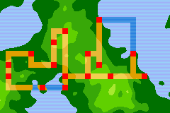
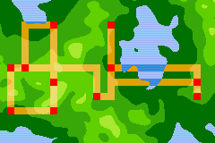
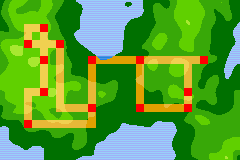

# Porygion

Porygion is a procedural region map generator in the Gen-3 Pokémon style.

It's available online in the [Porygion Playground](http://www.huderlem.com/porygion-playground/).

This repository contains the library code for generating the region map, and the interactive website's code is located in the [Porygion Playground](https://github.com/huderlem/porygion-playground) repository.

# Gallery

Below are some examples region maps that this library can generate.

